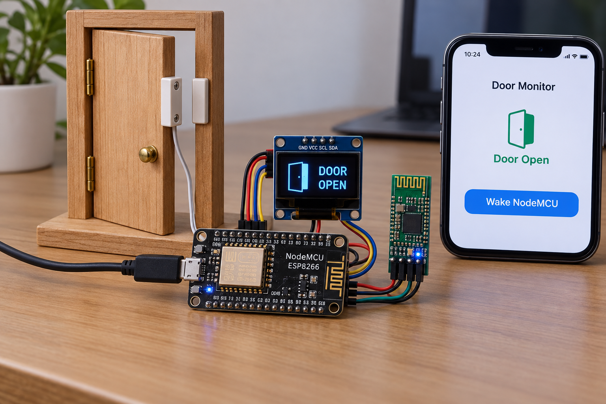
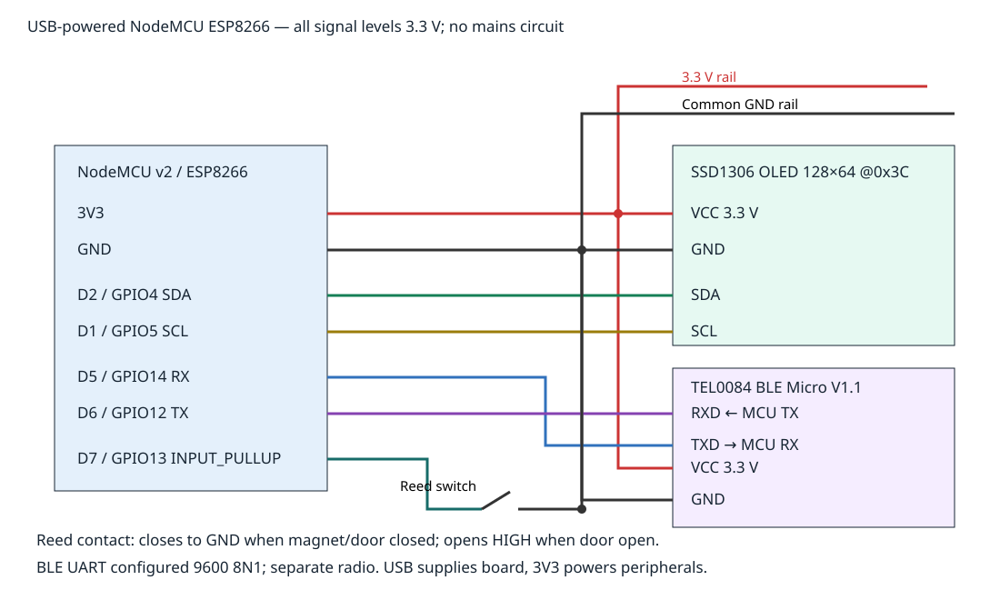

# Room Climate Hub Energy Saver
An educational ESP8266 prototype turns an OLED off after a door has remained closed for 15 seconds, wakes it when the door opens, and offers local BLE status and a temporary wake command. It demonstrates reducing unnecessary **display** operation; it does not measure household energy or control appliances.



## Objectives and features
Debounce a magnetic door contact; automatically blank an unused display; expose JSON status; demonstrate bounded command parsing and time rollover handling. Wi-Fi is disabled. No cloud account or credentials are required by the device.

## Architecture and platform
NodeMCU v2 / ESP8266 Arduino firmware owns the door policy and SSD1306 display. ESP8266 has no native BLE: a **DFRobot BLE Micro V1.1 TEL0084** transparent UART module is an additional required component. Phone ↔ BLE module ↔ 9600-baud UART ↔ controller. The controller continues running; this is not deep sleep or a security alarm.

## Bill of materials
|Quantity|Part|
|---:|---|
|1|NodeMCU v2 ESP8266, USB cable and regulated USB supply|
|1|SSD1306 128×64 I²C OLED, 3.3 V compatible, address 0x3C|
|1|Normally-open magnetic reed contact with magnet; contact closed when magnet adjacent|
|1|TEL0084 BLE Micro V1.1 with accessible labeled UART/power pads, firmware supporting transparent mode|
|1|3.3 V USB-UART adapter for initial BLE configuration|
|1 set|Breadboard, jumper wires and suitable module adapter|
Verify the NodeMCU regulator can supply board plus peripherals. Use a stable 3.3 V module supply; do not apply USB 5 V to module signal or VCC pads.

## Prerequisites
PlatformIO 6.1.18, Python 3, host g++, USB serial driver and a BLE-capable phone. Module configuration needs its manufacturer instructions and a 3.3 V serial adapter. See [BLE module specifications/pinout](https://wiki.dfrobot.com/tel0084/), [configuration guide](https://wiki.dfrobot.com/tel0084/docs/22180), [AT handbook](https://wiki.dfrobot.com/tel0084/docs/22179), and [board definition](https://docs.platformio.org/en/latest/boards/espressif8266/nodemcuv2.html).

## Exact pin map and circuit


|Controller|Connection|Level|
|---|---|---|
|3V3|OLED VCC and BLE VCC|3.3 V|
|GND|OLED GND, BLE GND, one reed terminal|Common ground|
|D2 / GPIO4|OLED SDA|3.3 V I²C|
|D1 / GPIO5|OLED SCL|3.3 V I²C|
|D7 / GPIO13|Other reed terminal|Internal pull-up; closed LOW, open HIGH|
|D5 / GPIO14 software RX|BLE TXD|3.3 V UART|
|D6 / GPIO12 software TX|BLE RXD|3.3 V UART|
Use **module pad labels** in the manufacturer pinout, not an assumed breakout order. UART crosses TX to RX. Unused module pads remain unconnected. The schematic shows functional pad labels and exact controller GPIO. Intersections without dots are not junctions; rails share labeled/common connections.

## Assembly
Disconnect power. Wire ground first, then 3.3 V and signals. Mount reed and magnet so a closed door closes the contact. Keep antennas clear of metal. Check supply polarity and resistance for shorts before USB power. Do not attach mains loads. With the door open the input must read HIGH; moving the magnet to the contact must read LOW.

## Setup and BLE configuration
Configure the isolated TEL0084 before attaching its UART to the controller. Initially use the module's default 115200 8N1 adapter setting. For supported firmware V1.8+, send `+++` with no line ending to enter AT mode. Send following commands with CR+LF, checking the module's acknowledgment after each:
```text
AT+FSM=FSM_TRANS_USB_COM_BLE
AT+ROLE=ROLE_PERIPHERAL
AT+NAME=EnergySaver
AT+UART=9600
AT+EXIT
```
After changing UART baud, switch the adapter to 9600 if subsequent responses require it; query `AT+UART=?` in AT mode to verify. Older firmware may use its documented AT-mode mechanism. Do not assume incompatible or cloned firmware supports these commands. Disconnect the configuration adapter before connecting ESP8266 UART.

## Flashing
```sh
python -m pip install platformio==6.1.18
pio run -e nodemcuv2
pio run -e nodemcuv2 -t upload
pio device monitor -b 115200
```
Select the detected upload port if multiple devices are connected. PlatformIO obtains the pinned platform and libraries in platformio.ini; libraries.md lists them.

## Configuration
The exact pin constants are in the .ino file. Policy timings are in policy.h: 50 ms debounce, 15000 ms closed idle, 30000 ms manual wake. BLE baud is 9600 8N1; USB logs are 115200. I²C address is 0x3C. Changing wiring or values requires updating the schematic/docs and rerunning tests.

## Usage and telemetry
Use a BLE terminal compatible with DFRobot transparent transmission (not Bluetooth Classic SPP). Connect to EnergySaver and enable its serial notifications; write ASCII `STATUS\n` or `WAKE\n` to its serial characteristic. Identify the writable/notifying serial characteristic for the actual module firmware using the manufacturer's compatible app; do not assume a generic Nordic UART UUID. USB serial shows the same status every second. STATUS returns current status, WAKE enables display for 30 seconds, unknown commands return unknown_command. Lines over 16 characters are discarded with line_too_long. CR is ignored; LF completes a command. Notifications may fragment JSON: collect until newline.

```json
{"id":4,"door_open":false,"display_on":false,"oled_present":true,"override_active":false}
```
All five fields are booleans except integer id. Sample-data contains a representative example, not a captured hardware measurement. If OLED initialization fails, oled_present is false; policy and UART continue and display_on denotes desired display state.

## Expected output and repeatable demonstration
Open the contact: after 50 ms debounce the panel stays on. Close it: it remains on for 15 seconds then blanks. Send WAKE: it lights for 30 seconds before returning to automatic policy; opening the door always lights it. Use a current meter before and after blanking to measure the actual peripheral current change yourself; no power savings figure is asserted.

## Tests and actual run results
Cloud CI runs g++ assertions covering debounce boundary, bounce rejection, automatic idle, manual wake expiry, unknown commands, timer rollover and overlong-line recovery. Completion validation checks PNG CRC/signature/pixels, image transport tests, SVG parse, local image links, MIT license and credential patterns; the board job builds the real ESP8266 firmware. **Actual cloud run:** [Actions recovery run 37414718524](https://github.com/OpenMakerProjects/room-climate-hub-energy-saver/actions/runs/37414718524) passed the native policy assertions, all three PNG-transport regression tests, PNG/SVG/link/license/credential checks, and the NodeMCU ESP8266 target build on decoded-image commit b06ee13df28048dc0c0177f3252f2ac629bed4fd. PNG: 1536×1024, 2099251 bytes, SHA-256 477882b4fcbb228833e9a6943944de8b3ae0cd32b220f242e20658c28f0a5e12. Final-head CI also runs on this documentation commit before merge. No physical wiring, BLE radio or power measurement has been performed.
```sh
python tools/validate.py
python tools/validate_completion.py
```

## Troubleshooting
Blank OLED: inspect oled_present, address, shared ground and SDA/SCL. BLE absent: verify module supply, peripheral role and advertised name. Garbled UART: match 9600 baud and cross TX/RX; ESP8266 software serial can lose bytes under load. No command response: enable notifications and include LF. Door always open: inspect magnet alignment and contact continuity; a broken wire also reads open. An unconfigured module may still be in AT mode.

## Limitations and safety
No authentication is implemented for WAKE/STATUS; any nearby compatible client may interact. Do not transmit private information. No HVAC, mains switching, access control, emergency or medical use. Reed polarity and OLED behavior need hardware verification. Controller/BLE radio remain powered, so total savings may be small; display-off is not a total system power cutoff. Use only low voltage supervised prototypes and protect exposed wiring.

## Future work
Measure power with controlled experiments; compare controller sleep strategies with wake-capable wiring; add authenticated BLE transport and hardware-in-loop tests.

## Contributing and license
Open a PR with matching wiring, documentation and meaningful policy tests. Run host validation and target build; report hardware evidence separately. MIT: see [LICENSE](LICENSE).
